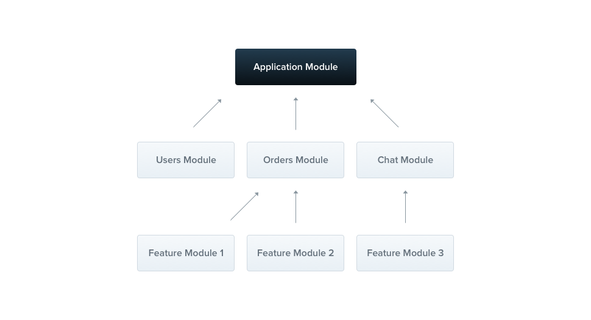

## nestjs practice

### platform


### controller


`nest g resource [name]` 快捷产生module

> State sharing#
> For developers coming from other programming languages, it might be surprising to learn that in Nest, nearly everything is shared across incoming requests. This includes resources like the database connection pool, singleton services with global state, and more. It's important to understand that Node.js doesn't use the request/response Multi-Threaded Stateless Model, where each request is handled by a separate thread. As a result, using singleton instances in Nest is completely safe for our applications.
>
> That said, there are specific edge cases where having request-based lifetimes for controllers may be necessary. Examples include per-request caching in GraphQL applications, request tracking, or implementing multi-tenancy. You can learn more about controlling injection scopes here.


### provider
>Providers are a core concept in Nest. Many of the basic Nest classes, such as services, repositories, factories, and helpers, can be treated as providers. The key idea behind a provider is that it can be injected as a dependency, allowing objects to form various relationships with each other. The responsibility of "wiring up" these objects is largely handled by the Nest runtime system. 


### Modules
A module is a class that is annotated with the @Module() decorator. This decorator provides metadata that Nest uses to organize and manage the application structure efficiently.


- Shared modules
In Nest, modules are singletons by default, and thus you can share the same instance of any provider between multiple modules effortlessly.


- Global modules
If you have to import the same set of modules everywhere, it can get tedious. Unlike in Nest, Angularproviders are registered in the global scope. Once defined, they're available everywhere. Nest, however, encapsulates providers inside the module scope. You aren't able to use a module's providers elsewhere without first importing the encapsulating module.

When you want to provide a set of providers which should be available everywhere out-of-the-box (e.g., helpers, database connections, etc.), make the module global with the @Global() decorator.


### pipe
Pipes have two typical use cases:

transformation: transform input data to the desired form (e.g., from string to integer)
validation: evaluate input data and if valid, simply pass it through unchanged; otherwise, throw an exception

### guard
Guards have a single responsibility. They determine whether a given request will be handled by the route handler or not, depending on certain conditions (like permissions, roles, ACLs, etc.) present at run-time. This is often referred to as authorization. Authorization (and its cousin, authentication, with which it usually collaborates) has typically been handled by middleware in traditional Express applications. Middleware is a fine choice for authentication, since things like token validation and attaching properties to the request object are not strongly connected with a particular route context (and its metadata).

But middleware, by its nature, is dumb. **<span style="color:red">It doesn't know which handler will be executed after calling the next() function</span>**. On the other hand, Guards have access to the ExecutionContext instance, and thus know exactly what's going to be executed next. They're designed, much like exception filters, pipes, and interceptors, to let you interpose processing logic at exactly the right point in the request/response cycle, and to do so declaratively. This helps keep your code DRY and declarative.

### interceptor
Interceptors have a set of useful capabilities which are inspired by the Aspect Oriented Programming (AOP) technique. They make it possible to:

bind extra logic before / after method execution
transform the result returned from a function
transform the exception thrown from a function
extend the basic function behavior
completely override a function depending on specific conditions (e.g., for caching purposes)


### decorator
An ES2016 decorator is an expression which returns a function and can take a target, name and property descriptor as arguments. You apply it by prefixing the decorator with an @ character and placing this at the very top of what you are trying to decorate. Decorators can be defined for either a class, a method or a property.

## DI

### [DI fundamentals](https://docs.nestjs.com/fundamentals/custom-providers)
Dependency injection is an inversion of control (IoC) technique wherein you delegate instantiation of dependencies to the IoC container (in our case, the NestJS runtime system), instead of doing it in your own code imperatively. Let's examine what's happening in this example from the Providers chapter.

First, we define a provider. The @Injectable() decorator marks the CatsService class as a provider.
Then we request that Nest inject the provider into our controller class:
Finally, we register the provider with the Nest IoC container:

When the Nest IoC container instantiates a CatsController, it first looks for any dependencies*. When it finds the CatsService dependency, it performs a lookup on the CatsService token, which returns the CatsService class, per the registration step (#3 above). Assuming SINGLETON scope (the default behavior), Nest will then either create an instance of CatsService, cache it, and return it, or if one is already cached, return the existing instance.

ads via Carbon
GPU-Powered Charts for React, Vue, Angular: Cross-Platform Charts That Never Slow Down. Free Trial.
ads via Carbon
Custom providers
In earlier chapters, we touched on various aspects of Dependency Injection (DI) and how it is used in Nest. One example of this is the constructor based dependency injection used to inject instances (often service providers) into classes. You won't be surprised to learn that Dependency Injection is built into the Nest core in a fundamental way. So far, we've only explored one main pattern. As your application grows more complex, you may need to take advantage of the full features of the DI system, so let's explore them in more detail.

DI fundamentals#
Dependency injection is an inversion of control (IoC) technique wherein you delegate instantiation of dependencies to the IoC container (in our case, the NestJS runtime system), instead of doing it in your own code imperatively. Let's examine what's happening in this example from the Providers chapter.

First, we define a provider. The @Injectable() decorator marks the CatsService class as a provider.


cats.service.tsJS

import { Injectable } from '@nestjs/common';
import { Cat } from './interfaces/cat.interface';

@Injectable()
export class CatsService {
  private readonly cats: Cat[] = [];

  findAll(): Cat[] {
    return this.cats;
  }
}
Then we request that Nest inject the provider into our controller class:


cats.controller.tsJS

import { Controller, Get } from '@nestjs/common';
import { CatsService } from './cats.service';
import { Cat } from './interfaces/cat.interface';

@Controller('cats')
export class CatsController {
  constructor(private catsService: CatsService) {}

  @Get()
  async findAll(): Promise<Cat[]> {
    return this.catsService.findAll();
  }
}
Finally, we register the provider with the Nest IoC container:


app.module.tsJS

import { Module } from '@nestjs/common';
import { CatsController } from './cats/cats.controller';
import { CatsService } from './cats/cats.service';

@Module({
  controllers: [CatsController],
  providers: [CatsService],
})
export class AppModule {}
What exactly is happening under the covers to make this work? There are three key steps in the process:

In cats.service.ts, the @Injectable() decorator declares the CatsService class as a class that can be managed by the Nest IoC container.
In cats.controller.ts, CatsController declares a dependency on the CatsService token with constructor injection:


  constructor(private catsService: CatsService)
In app.module.ts, we associate the token CatsService with the class CatsService from the cats.service.ts file. We'll see below exactly how this association (also called registration) occurs.
When the Nest IoC container instantiates a CatsController, it first looks for any dependencies*. When it finds the CatsService dependency, it performs a lookup on the CatsService token, which returns the CatsService class, per the registration step (#3 above). Assuming SINGLETON scope (the default behavior), Nest will then either create an instance of CatsService, cache it, and return it, or if one is already cached, return the existing instance.

*This explanation is a bit simplified to illustrate the point. One important area we glossed over is that the process of analyzing the code for dependencies is very sophisticated, and happens during application bootstrapping. One key feature is that dependency analysis (or "creating the dependency graph"), is transitive. In the above example, if the CatsService itself had dependencies, those too would be resolved. The dependency graph ensures that dependencies are resolved in the correct order - essentially "bottom up". This mechanism relieves the developer from having to manage such complex dependency graphs.

 

- Standard providers
```js
@Module({
  controllers: [CatsController],
  providers: [CatsService],
})
```
The providers property takes an array of providers. So far, we've supplied those providers via a list of class names. In fact, the syntax providers: [CatsService] is short-hand for the more complete syntax:
```js
providers: [
  {
    provide: CatsService,
    useClass: CatsService,
  },
];
```

## Dynamic modules
With static module binding, there's no opportunity for the consuming module to influence how providers from the host module are configured. Why does this matter? Consider the case where we have a general purpose module that needs to behave differently in different use cases. This is analogous to the concept of a "plugin" in many systems, where a generic facility requires some configuration before it can be used by a consumer.
```js
import { Module } from '@nestjs/common';
import { AppController } from './app.controller';
import { AppService } from './app.service';
import { ConfigModule } from './config/config.module';

@Module({
  imports: [ConfigModule.register({ folder: './config' })],
  controllers: [AppController],
  providers: [AppService],
})
export class AppModule {}
```
Let's see what's happening in the dynamic example above. What are the moving parts?

ConfigModule is a normal class, so we can infer that it must have a static method called register(). We know it's static because we're calling it on the ConfigModule class, not on an instance of the class. Note: this method, which we will create soon, can have any arbitrary name, but by convention we should call it either forRoot() or register().
The register() method is defined by us, so we can accept any input arguments we like. In this case, we're going to accept a simple options object with suitable properties, which is the typical case.
We can infer that the register() method must return something like a module since its return value appears in the familiar imports list, which we've seen so far includes a list of modules.

- register：配置模块并且该配置仅对当前模块有效，适合每个实例都有不同配置的场景。
- forRoot：配置全局模块并且该配置在应用中复用一次，适合全局共享配置的场景。
- forFeature：基于 forRoot 配置的全局模块，允许在特定模块中进一步修改配置，适合需要为某些模块定制配置的场景。

## lifecycle events
